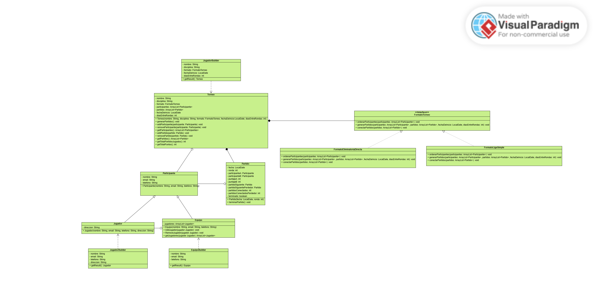

# Proyecto final

## Número de grupo
12

## Nombres
- Iván Camilo Cisternas Moreno
- Ignacio Tomas Garcia Fernandez
- Dante Leal Levancini

## Enunciado
### Sistema de Gestión de Torneos
- Este sistema está diseñado para facilitar la organizacíon de torneos deportivos o de juegos. Permitirá a un organizador definir las características del torneo, 
como el nombre, la disciplina (ej. fútbol, ajedrez, videojuegos), las fechas y un formato principal (como eliminatoria directa, eliminatorio doble, liga simple...). 
Se podrán inscribir participantes, ya sean jugadores individuales o equipos, almacenando información básica como nombres y datos de contacto. El sistema deberá ser 
capaz de generar un calendario de enfrentamientos o un bracket inicial basado en los inscritos y el formato. Durante el torneo, se registrarán los resultados de cada 
enfrentamiento, lo que actualizará automáticamente las posiciones, el avance en el bracket o las tablas de clasificación. Los usuarios podrán visualizar el estado 
actual del torneo, los próximos encuentros y las estadísticas generales.

## Diagrama de casos de uso

## Captura de pantalla de la interfaz

## Diagrama de clases UML

## Patrones de diseño usados
### Builder
- Usamos el patrón Builder para facilitar la creación de objetos grandes como el Torneo, el Equipo y el Jugador. Esto ayuda mucho para cuando vamos a usar la interfaz gráfica, porque podemos construir esos objetos paso a paso según lo que el usuario vaya ingresando, sin tener que pasar mil parámetros de una vez. También hace el código más ordenado y evita errores con constructores muy largos.
- Clases que usan este patrón: TorneoBuilder, EquipoBuilder y JugadorBuilder.
### Strategy
- Se utilizó para separar la lógica de los formatos de torneo, como eliminatoria directa y liga simple. Así, si queremos agregar otro formato, solo hacemos una clase nueva que implemente la interfaz FormatoTorneo y no modificamos la clase principal del torneo. Esto hace que el código sea más fácil de mantener y modificar.
- Clases que usan este patrón: FormatoEliminatoriaDirecta y FormatoLigaSimple

## Decisiones importantes
- Elegimos usar builders porque pensamos que así sería más fácil crear los objetos desde la interfaz gráfica, así el usuario solo va llenando datos y se van construyendo los objetos poco a poco.
- Usamos Strategy para que la lógica de cada formato de torneo esté separada. Así el código queda más limpio y fácil de extender.
- Separamos el modelo y la vista para que el código esté organizado.
- Agregamos excepciones personalizadas para controlar mejor los errores.

## Problemas identificados y autocrítica
- Uno de los principales problemas fue la generación de los brackets para la eliminatoria directa, ya que implica conducir a los ganadores a partidos distintos. Inicialmente, no se planificó esta lógica con claridad, lo que llevó a reestructurar varias veces las clases FormatoEliminatoriaDirecta y la interfaz FormatoTorneo y a tardar más del tiempo esperado en completar dichas funciones.
- En retrospectiva, podríamos haber definido desde el inicio una estructura más clara para manejar la lógica de conexión entre partidos, lo cual habría evitado mucha complejidad innecesaria al final.