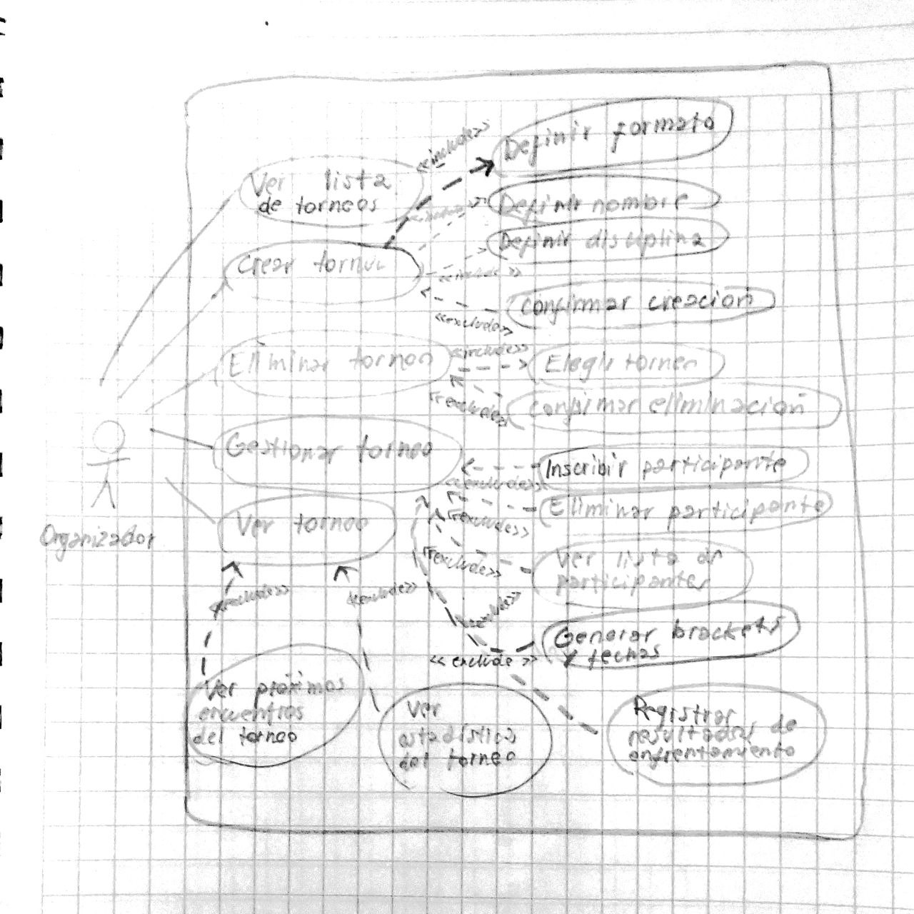

# Proyecto final

<b>Autores:</b> 
- Iván Camilo Cisternas Moreno
- Ignacio Tomas Garcia Fernandez
- Dante Leal Levancini

<b>Tema 1:  Sistema de Gestión de Torneos:</b>
- Este sistema está diseñado para facilitar la organizacíon de torneos deportivos o de juegos. Permitirá a un organizador definir las características del torneo, 
como el nombre, la disciplina (ej. fútbol, ajedrez, videojuegos), las fechas y un formato principal (como eliminatoria directa, eliminatorio doble, liga simple...). 
Se podrán inscribir participantes, ya sean jugadores individuales o equipos, almacenando información básica como nombres y datos de contacto. El sistema deberá ser 
capaz de generar un calendario de enfrentamientos o un bracket inicial basado en los inscritos y el formato. Durante el torneo, se registrarán los resultados de cada 
enfrentamiento, lo que actualizará automáticamente las posiciones, el avance en el bracket o las tablas de clasificación. Los usuarios podrán visualizar el estado 
actual del torneo, los próximos encuentros y las estadísticas generales.

<b>Diagrama de casos de uso:</b>

<b>Patrones de diseño</b>
- Builder: Se ha usado para que construir el torneo paso a paso dentro de la interfaz de usuario sea más cómodo.
