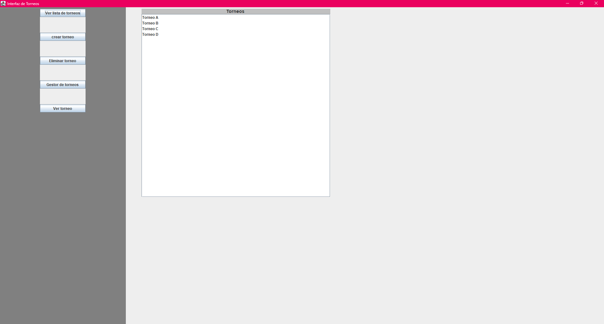

# Proyecto final

## Número de grupo
12

## Nombres
- Iván Camilo Cisternas Moreno
- Ignacio Tomas Garcia Fernandez
- Dante Leal Levancini

## Enunciado
### Sistema de Gestión de Torneos
- Este sistema está diseñado para facilitar la organizacíon de torneos deportivos o de juegos. Permitirá a un organizador definir las características del torneo, 
como el nombre, la disciplina (ej. fútbol, ajedrez, videojuegos), las fechas y un formato principal (como eliminatoria directa, eliminatorio doble, liga simple...). 
Se podrán inscribir participantes, ya sean jugadores individuales o equipos, almacenando información básica como nombres y datos de contacto. El sistema deberá ser 
capaz de generar un calendario de enfrentamientos o un bracket inicial basado en los inscritos y el formato. Durante el torneo, se registrarán los resultados de cada 
enfrentamiento, lo que actualizará automáticamente las posiciones, el avance en el bracket o las tablas de clasificación. Los usuarios podrán visualizar el estado 
actual del torneo, los próximos encuentros y las estadísticas generales.

## Diagrama de casos de uso

## Captura de pantalla de la interfaz

## Diagrama de clases UML

## Patrones de diseño usados
### Builder
- Se ha usado para que construir el torneo paso a paso dentro de la interfaz de usuario sea más cómodo. Lista de clases utilizadas: TorneoBuilder, EquipoBuilder, JugadorBuilder
### Strategy
- Se utilizó para encapsular los diferentes formatos de torneo, como eliminatoria directa, eliminatoria doble y liga simple. Esto permite agregar nuevos formatos sin modificar la clase Torneo. Clases involucradas: FormatoEliminatoriaDirecta, FormatoEliminatoriaDoble, FormatoLigaSimple, Torneo

## Decisiones importantes
- Se implementaron builders para las entidades Torneo, Jugador y Equipo pensando en la futura integración con formularios interactivos.
- Se decidió usar el patrón Strategy para separar la lógica de generación de partidos según el formato, facilitando la escalabilidad del sistema.
- Se dividió el proyecto en modelo y vista para mantener un diseño limpio y facilitar pruebas unitarias.

## Problemas identificados y autocrítica
- Uno de los principales problemas fue la generación de los brackets para la eliminatoria directa, ya que implica conducir a los ganadores a partidos distintos. Inicialmente, no se planificó esta lógica con claridad, lo que llevó a reestructurar varias veces las clases FormatoEliminatoriaDirecta y la interfaz FormatoTorneo y a tardar más del tiempo esperado en completar dichas funciones.
- En retrospectiva, podríamos haber definido desde el inicio una estructura más clara para manejar la lógica de conexión entre partidos, lo cual habría evitado mucha complejidad innecesaria al final.